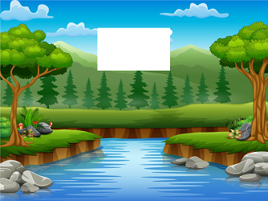
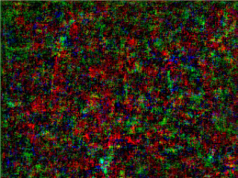

# Restoration-of-damaged-images-using-deep-learning

### Overview
Academic project oriented by Prof. Guillaume Bourmaud at Bordeaux INP - ENSEIRB MATMECA [Bordeaux Graduate School of Engineering]:    

Pytorch implementation of a deteriorated image restoration algorithm based on “[Deep Image Prior](https://dmitryulyanov.github.io/deep_image_prior)” research paper.

### Introduction

When an image has deteriorated, that is to say that some of the visual content is lost, it is sometimes important to perform a restoration step "inpainting". This step usually involves recreating visual information at damaged locations so that a human being can not say that it is a deteriorated image that has been restored.
The objective of this project is to implement in Pytorch a deteriorated image restoration algorithm using an approach based on neural networks.

### Method

The goal of this project is to achieve a deep neural network that performs restoration to deteriorated images. 

To carry out this project, we put into play 4 images:
- The original image: it is the unaltered image, with no missing information. We will never give this image to the neural network. We used it to compare visually with the output of the neural network. We also used it in our program to create the deteriorated image. 

- The damaged image: This is the image for which a part of information is missing. 

- The input image: This is the input image of the model initialied randomly.

- The output image: This image is produced by the model when given the initial random input image.

### Contributors, Contact and License

Abdelkarim ELASSAM,  2019  
abdelkarim.elassam@enseirb-matmeca.fr  
ENSEIRB-MATMECA (Bordeaux INP), Electronic Engineering - Signal and Image Processing

Augustin HUET,  2019  
augustin.huet@enseirb-matmeca.fr  
ENSEIRB-MATMECA (Bordeaux INP), Electronic Engineering - Embedded Systems
 

This code is free to use, share and modify for any non-commercial purposes.  
Any commercial use is strictly prohibited without the authors' consent.

